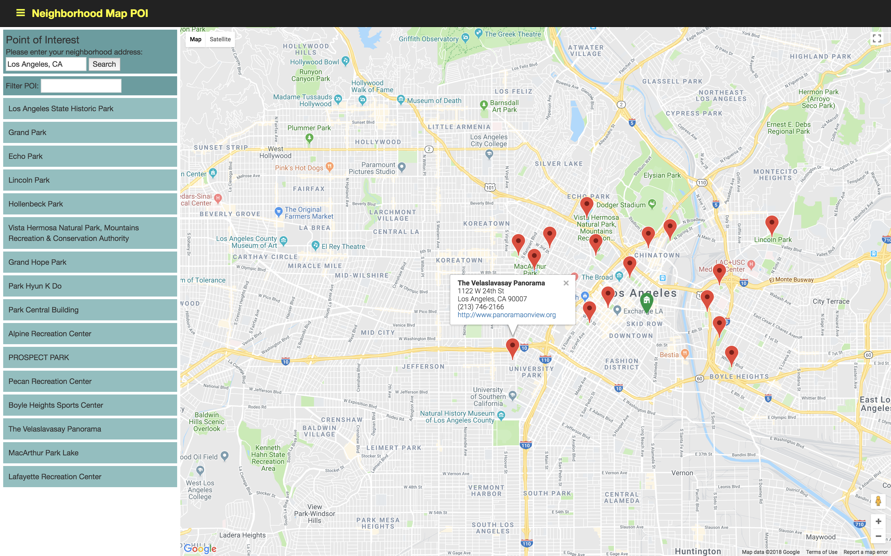

## Neighborhood Map Project
------------------------

<kbd>

</kbd>

Content

1. Project Description
2. App Functionalities
3. How to Run the Project
4. Tools
5. Improvement

### 1. Project Description:
-----------------------

This website display a map of the neighborhood that user has provided base
on the location such as full post office address or city, state.
The page will display the list of point of interests around the base 
location and mark those point of interests on the map.

### 2. App Functionalities:
-----------------------------
 
- Automatically adapts to different viewports, adjusts bounds and zooms to accommodate all markers.
- Notifies users if an error occurs.
- Menu opens and closes with the hamburger icon
- Collects data using Google Maps APIs and Foursqure APIs.
- List of point of interest can be filtered by keywords in the Search bar. Filtering the list also filters respective map markers.
- Click on marker changes infowindow properties.
    
### 3. How to Run the Project:
--------------------------

Experience the app at http://155.186.92.206:99/FSND-11-Neighborhood-Map/

To explore the codebase:

- Clone or download the ZIP link
- Open the index.html file.
- You need a working internet connection because the app draws information from Google Maps & Foursqure.

### 4. Tools:
---------
- Knockout.js
- jQuery
- Bootstrap Library
- Google Map API V3
- Foursquare API

### 5. Improvement:
---------------

For current version, the app only provide the point of interest for 'park' place type only. In the future, the app
should display multiple types of location such as school, beach, store, etc.